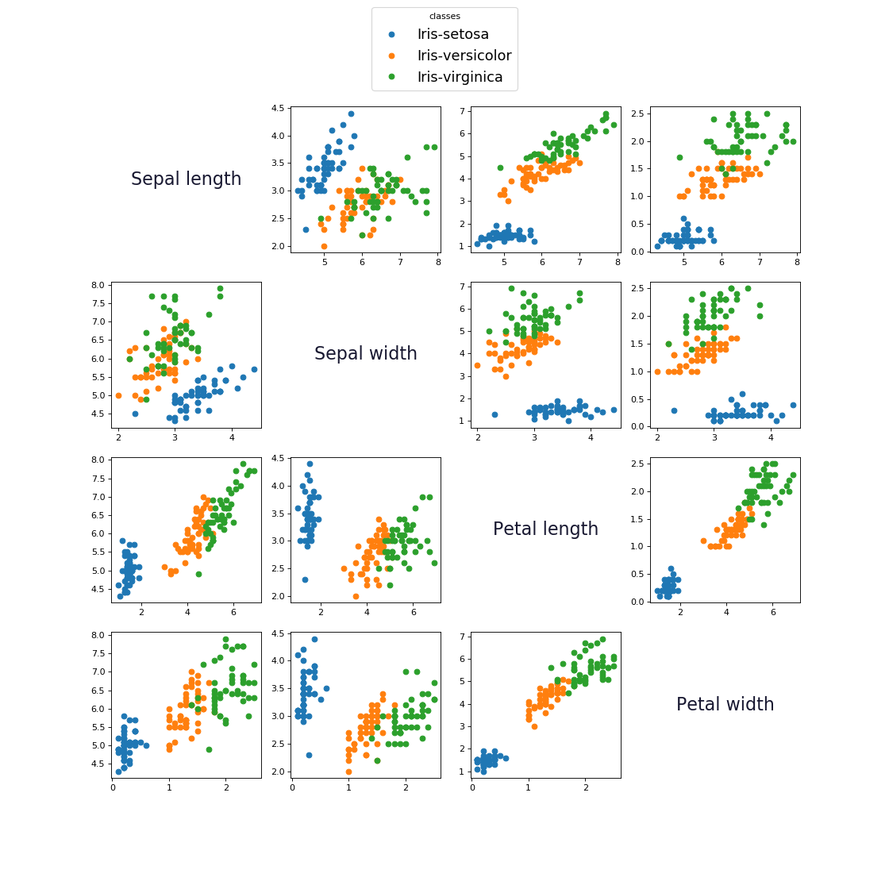
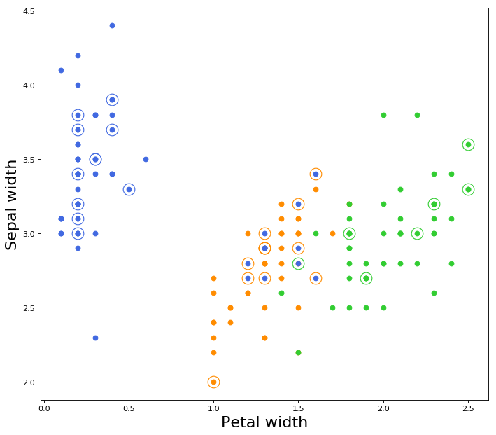
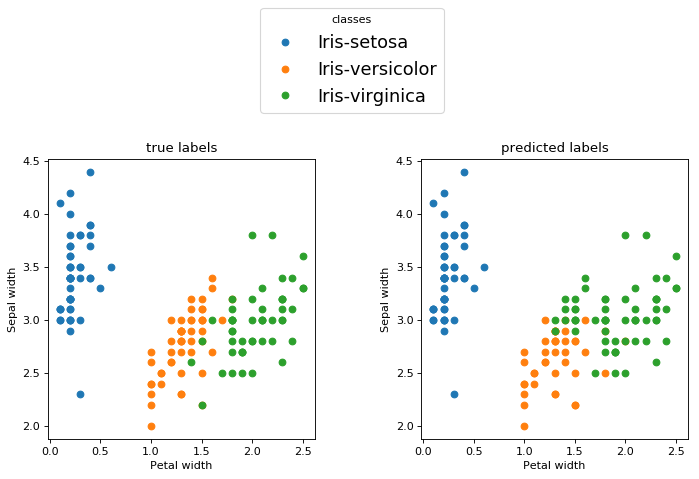
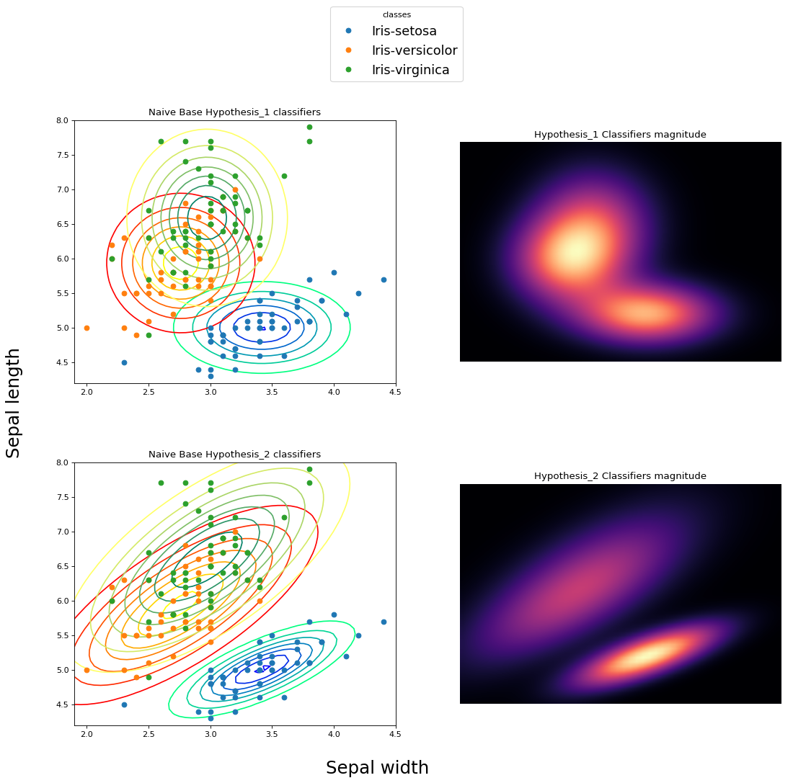

# Pattern Recognition-Iris Dataset Classification
**IRIS DATASET 150 records**
Every record has 4 features of datatype float and 1 true class index of datatype integer.


```python
# Pattern Recognition
# Classification of Iris Dataset
import numpy as np
import matplotlib.pyplot as plt
import os
import urllib.request

# Load Iris
class Irisdataset:
    feature_names = ['Sepal length', 'Sepal width', 'Petal length', 'Petal width']
    set_names = ['Iris-setosa', 'Iris-versicolor', 'Iris-virginica']

    # trn: number of traning examples
    # 150-trn: number of test examples
    def __init__(self, trn=120):
        # 0<=TR_data<=150
        N = trn
        # Testing samples 150-N
        self._AR = np.zeros((150, 5))

        if not os.path.isfile('iris.data'):
            print('Download IRIS dataset')
            urllib.request.urlretrieve(
                "https://archive.ics.uci.edu/ml/machine-learning-databases/iris/iris.data",
                "iris.data"
            )
            print('Download complete')

        with open('iris.data', 'r') as f:
            i = 0
            for Line in f:
                line = Line[:-1].split(',')
                line[0] = float(line[0])
                line[1] = float(line[1])
                line[2] = float(line[2])
                line[3] = float(line[3])
                if(line[4] == 'Iris-setosa'):
                    line[4] = 0.0
                elif(line[4] == 'Iris-versicolor'):
                    line[4] = 1.0
                elif(line[4] == 'Iris-virginica'):
                    line[4] = 2.0

                self._AR[i] = np.array(line)
                i += 1
                if i == 150:
                    break
        self._AR = np.random.permutation(self._AR) # random sort
        self.TrainData = self._AR[:N]
        self.TestData = self._AR[N:]
```

### Linear Classification - Perceptron
One Layer Perceptron with 3 simple neurons,<br>
choice two features for classifier inputs,<br>
Training set: 120 examples<br>
Test set:     30 examples<br>
Final classification error average errors choosing training & test examples 5 times at random.


```python
# Methods
Hot = lambda x:[1 if i==x else -1 for i in range(3)]
```


```python
learning_rate = 0.7
total_test_error = 0

f0 = 3
f1 = 1
for cnt in range(5):
    iris = Irisdataset(120)  # 120 train data
    train_data = iris.TrainData[:,[f0,f1]]
    train_hot = -1*np.ones((120,3))
    train_hot[range(120),iris.TrainData[:,-1].astype(int)] = 1

    test_data = iris.TestData[:,[f0,f1]]
    test_hot = -1*np.ones((30,3))
    test_hot[range(30),iris.TestData[:,-1].astype(int)] = 1

    W = np.random.rand(2, 3) # Weights
    B = np.random.rand(1, 3) # Bias

    # Training
    # update W, B 200 times or Epochs = 200
    for i in range(200):
        tr_error = 0
        for tr_d,tr_hot in zip(train_data,train_hot):
            # forward pass
            tr_d = tr_d.reshape(1, 2)
            neurons_outs = np.dot(tr_d, W)+B

            # outputs indexis with wrong prediction class
            tr_error+=np.where(neurons_outs*tr_hot<0)[0].size>0

            # backward pass
            neurons_outs[np.where(neurons_outs*tr_hot>0)] = 0
            neurons_outs = np.sign(neurons_outs)

            # Deltas
            DW = -learning_rate*np.dot(tr_d.T,neurons_outs)
            DB = -learning_rate*neurons_outs

            # Update
            W += DW
            B += DB

    test_neurons_outs = np.dot(test_data, W)+B
    test_prediction = test_neurons_outs.argmax(1)
    ts_error = sum(test_hot.argmax(1) != test_prediction)
    total_test_error += ts_error

    print('Round {0:d}: Test error={1:.2f}'.format(cnt+1, ts_error/30))

print('\nAverage Test error={0:.2f}'.format(total_test_error/(5*30)))
```

### Mean Square Error(MSE), leave-one-out cross validation error

Minimize MSE of a linear classifier using normal equation.
Using all features for train & validation.


```python
# Methods
def normal_eq(X,Y):
    W = np.linalg.inv(np.dot(X.T, X))
    W = np.dot(np.dot(W, X.T), Y)
    return W
```


```python
iris = Irisdataset(150)

def_tr_index = lambda x,n:[False if j==x else True for j in range(n)]
error = 0
S_Examples = iris.TrainData
N = S_Examples.shape[0]

S_Data = S_Examples[:,:-1]
S_Data = np.concatenate((np.ones((N,1)),S_Data),axis=1)
S_Hot = np.zeros((N,3))
S_Hot[range(N),S_Examples[:,-1].astype(int)] = 1
for i in range(N):
    tr_index = np.array(def_tr_index(i,N))

    tr_data = S_Data[tr_index]
    tr_hot = np.array([S_Hot[tr_index] == 1]).reshape(-1,3)

    ts_data = S_Data[i].reshape(1,-1)
    ts_hot = np.array([S_Hot[i] == 1]).reshape(-1,3)
    W = normal_eq(tr_data,tr_hot)
    W[0,:]+=0
    ts_pr = np.dot(ts_data,W)
    cl_p = np.sum(ts_pr.argmax()!=ts_hot.argmax())
    error += cl_p

print('Test error: {0:.2f}'.format(error/N))
```


### Naive Bayes classifier, leave-one-out cross validation
* hypothesis 1: all features are independent and following the normal distribution
* hypothesis 2: all fatures follow 4D normal distribution


```python
# Methods
Normal_dist = lambda x,avg, std: 1/np.sqrt(2*np.pi*std**2)*np.exp(-(x-avg)**2/(2*std**2))

ND_mahalanobis = lambda x,mean,S: np.dot(np.dot((x-mean).T,np.linalg.inv(S)),(x-mean))**(1/2)

def ND_normal_dist(x,mean,S):
    m_dist = ND_mahalanobis(x, mean, S)
    constant = 1/((2*np.pi)**(4/2)*np.linalg.det(S)**(1/2))
    return constant*np.exp(-1/2*np.square(m_dist))
```


```python
iris = Irisdataset(150) # all dataset

error_h1=0 # hypothesis_1 error
error_h2=0 # hypothesis_2 error

def_tr_index = lambda x:[False if j==x else True for j in range(150)]
for i in range(150):

    tr_index = np.array(def_tr_index(i))
    tr_data = iris.TrainData[tr_index]
    # get i_th record for validation
    vl_data = iris.TrainData[i]


    # Estimate maximum likelihood per feature
    # AVG - STD
    # Setosa
    tr_setosa = tr_data[np.where(tr_data[:,4] == 0)][:,:4]
    tr_setosa_avg_per_feature = np.mean(tr_setosa,axis=0)
    tr_setosa_std_per_feature = np.std(tr_setosa, axis=0)

    # Versicolor
    tr_versicolor = tr_data[np.where(tr_data[:,4] == 1)][:,:4]
    tr_versicolor_avg_per_feature = np.mean(tr_versicolor, axis=0)
    tr_versicolor_std_per_feature = np.std(tr_versicolor, axis=0)

    # Virginica
    tr_virginica = tr_data[np.where(tr_data[:,4] == 2)][:,:4]
    tr_virginica_avg_per_feature = np.mean(tr_virginica, axis=0)
    tr_virginica_std_per_feature = np.std(tr_virginica, axis=0)


    # hypothesis 1 START
    # Test Model
    # class confidence per feature
    h1_conf_setosa = Normal_dist(vl_data[:-1], tr_setosa_avg_per_feature, tr_setosa_std_per_feature)
    h1_conf_versicolor = Normal_dist(vl_data[:-1], tr_versicolor_avg_per_feature, tr_versicolor_std_per_feature)
    h1_conf_virginica = Normal_dist(vl_data[:-1], tr_virginica_avg_per_feature, tr_virginica_std_per_feature)

    # prediction_class
    arg_max_class_conf_per_feature = np.argmax([
            h1_conf_setosa,
            h1_conf_versicolor,
            h1_conf_virginica      
        ], axis=0)
    counts = np.bincount(arg_max_class_conf_per_feature)
    h1_prediction_class = np.argmax(counts)

    # add 1 if true_class != prediction_class
    error_h1 += h1_prediction_class != vl_data[-1]
    # hypothesis 1 END

    # hypothesis 2 START
    # calculate converance by class
    tr_setosa_cov = np.cov((tr_setosa).T)
    tr_versicolor_cov = np.cov((tr_versicolor).T)
    tr_virginica_cov = np.cov((tr_virginica).T)

    # class confidence
    h2_conf_setosa = ND_normal_dist(vl_data[:-1].reshape(4,1),tr_setosa_avg_per_feature.reshape(4,1),tr_setosa_cov)
    h2_conf_versicolor = ND_normal_dist(vl_data[:-1].reshape(4,1),tr_versicolor_avg_per_feature.reshape(4,1),tr_versicolor_cov)
    h2_conf_virginica = ND_normal_dist(vl_data[:-1].reshape(4,1),tr_virginica_avg_per_feature.reshape(4,1),tr_virginica_cov)

    h2_prediction_class = np.argmax([h2_conf_setosa, h2_conf_versicolor, h2_conf_virginica])

    # add 1 if true_class != prediction_class
    error_h2 += h2_prediction_class != vl_data[-1]
    # hypothesis 2 END

print(error_h1/150)
print(error_h2/150)
```

## Conclusion
* **Perceptron:**<br />
    Round 1: Test error=0.13<br />
    Round 2: Test error=0.33<br />
    Round 3: Test error=0.20<br />
    Round 4: Test error=0.10<br />
    Round 5: Test error=0.40<br /><br />
    Average Test error=0.23
* **MSE method:**<br />
    Test error: 0.18
* **Naive Bayes:**<br />
    hypothesis 1 Test error: 0.1<br />
    hypothesis 2 Test error: 0.026


### Perceptron
As you can see all classes couldn't be separated with a single line.
<br/>
From the above image if we choose the features Sepal-Width and Petal-Width, the classes are relatively linearly separable from one another.<br>

All test data marked as circle with dot in center.<br>
Color of circle is equivalent to true label,<br>
Color of dot is equivalent to predicted label.
<br/>

### Mean Square Error(MSE)
This 4-D hyperplane is not able to seperate fully the data of the classes.<br>
Something interesting happens though if we choose to show the examples from the two features
<br/>
This 4-D hyperplane works as a non-linear classifier for these two features.

### Naive Bayes - Hypothesis 1 vs  Hypothesis 2
In he next picture, the second classifier fits better on the dataset. Both classifiers have the attribute of vertical and horizontal "stretching". The second clarifier achieves to make relationships between features and this could be described as a slope.
<br/>
